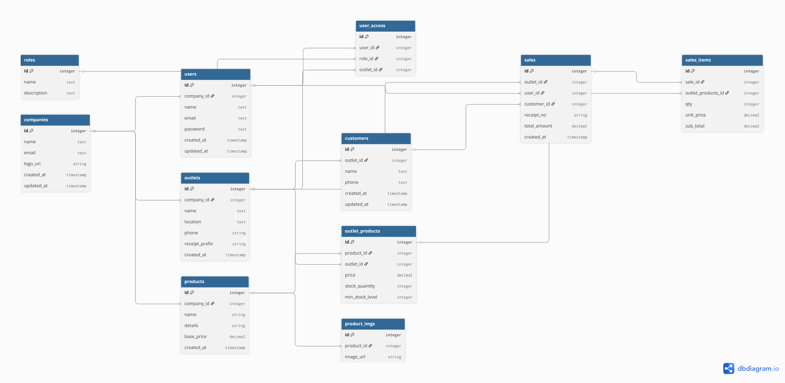

# 🚀 Centralized Multi-Outlet POS & Inventory System

A robust SaaS-based POS and Inventory management solution built for companies managing multiple outlets from a central HQ. This system focuses on multi-tenancy, data isolation, and a seamless user experience.

---

## 🏗️ Architecture Overview

The project is built using a **Layered Architecture (N-Tier)** to ensure scalability and maintainability:

- **Routes:** API endpoint definitions.
- **Controllers:** Request handling and response orchestration.
- **Services:** Core business logic and rules.
- **Repositories:** Persistent data access via **Prisma ORM**.
- **Validation:** Schema-based validation using **Zod**.

---

## 🛠️ Tech Stack

- **Backend:** Node.js, Express.js, TypeScript
- **Database:** PostgreSQL (Prisma ORM)
- **Frontend:** React.js (Material UI)
- **Containerization:** Docker & Docker Compose

---

## 🚦 Getting Started (Installation)

### 💡 Note for Reviewer

> **Plug-and-Play Setup:** To make the evaluation process easier for you, I have already **pre-configured the environment** and **seeded the database** with initial data (Users, Products, Sales, etc.). You don't need to manually run any seed scripts; Docker will handle everything during the first build.

### 🛠️ Step-by-Step Setup

1.  **Clone the repo:**

    ```bash
    git clone <your-repo-url>
    cd sass-inventory-assessment
    ```

2.  **Environment Variables:**
    I have provided a `.env`:

    _(The default values are optimized for the Docker environment)._

3.  **Run with Docker:**
    Start the entire system with one command. This will automatically run migrations and seed the database for your convenience:

    ```bash
    docker-compose up --build
    ```

4.  **Access Links:**
    - **Frontend:** [http://localhost:3000](http://localhost:3000)
    - **Backend API:** [http://localhost:5000](http://localhost:5000)
    - **pgAdmin:** [http://localhost:5050](http://localhost:5050)

---

## 🔑 Demo Credentials (Pre-seeded)

Use these accounts to explore the system's role-based access control:

| Role               | Email                     | Password      |
| :----------------- | :------------------------ | :------------ |
| **Super Admin**    | `superadmin@rakibpos.com` | `password123` |
| **Branch Manager** | `manager@rakibpos.com`    | `password123` |

---

## 📊 Database Design

The relational schema handles complex multi-outlet inventory tracking.



---
